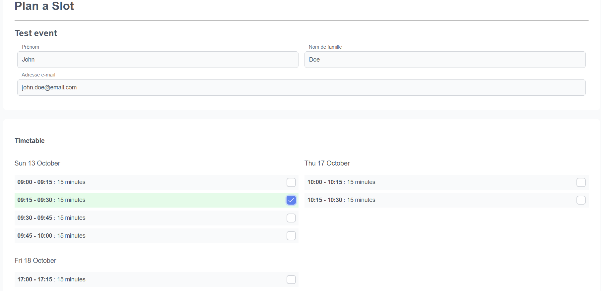
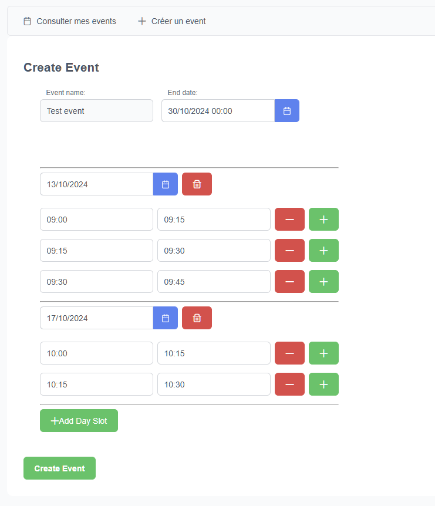
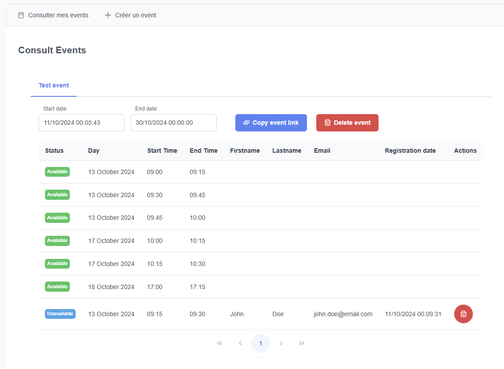
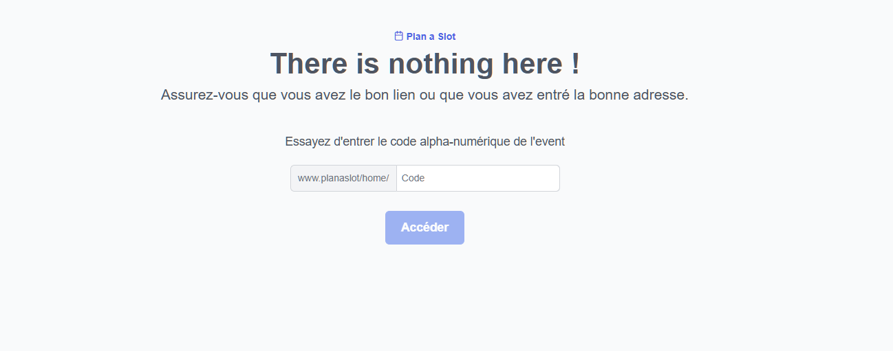

# PlanASlot


PlanASlot is an easy to use planner, minimalist and efficient. Used to schedule individual slots of time for different events, it's ideal schedule individual meetings, appointments, interviews, etc. Turnkey solution for scheduling for small businesses, freelancers, teachers, students, etc.

---

> PlanASlot was an opportunity for me to try building a shortnotice project from scratch under 10 hours !

---



---

## Table of contents

- [Features](#features)
- [Installation](#installation)
  - [Docker](#docker)
  - [Development](#development)
    - [Requirements](#requirements)
    - [Server](#server)
    - [Client](#client)
    - [Database](#database)
- [Future improvements](#future-improvements)
- [License](#license)

---

## Features

- **Minimalist**: Simple and easy to use.
- **Efficient**: Quickly schedule slots of time.
- **Customizable**: Customize the time slots and the number of slots.
- **No subscription**: Free to use, no subscription required.

---

### Easily schedule one or more events



You can easily schedule one or more events by selecting the date, time, and duration of each slots for the event. You can also customize the time slots, the number of slots and also a termination date for the event where users will only be able to check in read-only mode their reservations.

---



Have a simple, minimalist and efficient view of your schedule. You can easily see the slots of time for each event.

You can also quickly copy the generated link to share it with your contacts.

### Your user is lost ?



No problem, the default page helps the user to understand the purpose of the application and how to use it.

---

## Installation

> The server is written in TypeScript and uses the Express.js framework. The client is written in TypeScript and uses the Angular framework with PrimeNG components.

### Docker

**The whole application is dockerized.**

1. Clone the repository
2. Setup the environment variables in the `.env` file
3. Run `docker-compose up -d`

You're good to go !

### Development

#### Requirements

| Requirement | Version |
| ----------- | ------- |
| Node.js     | >=18.x  |
| npm         | >=10.x  |
| Angular     | >=18.x  |

#### Server

```bash
cd server
npm install # Install all the dependencies
npm run dev # Start the server in development mode

# Or if you want to build the server
npm run build
```

#### Client

```bash
cd client
npm install # Install all the dependencies
ng serve # Start the client in development mode

# Or if you want to build the client
ng build
```

#### Database

Database schema:

```sql
CREATE TABLE IF NOT EXISTS Events (
   Id_Event VARCHAR(28),
   name VARCHAR(100) NOT NULL,
   startDatetime TIMESTAMP NOT NULL,
   endDatetime TIMESTAMP NOT NULL,
   PRIMARY KEY(Id_Event)
);

CREATE TABLE IF NOT EXISTS Registrations (
   Id_Registration SERIAL,
   email VARCHAR(320) NOT NULL,
   firstname VARCHAR(50) NOT NULL,
   lastname VARCHAR(50) NOT NULL,
   registerDatetime TIMESTAMP NOT NULL,
   PRIMARY KEY(Id_Registration)
);

CREATE TABLE IF NOT EXISTS Slots (
   Id_Booking SERIAL,
   startDatetime TIMESTAMP NOT NULL,
   endDatetime TIMESTAMP NOT NULL,
   Id_Event VARCHAR(28) NOT NULL,
   Id_Registration INTEGER,
   PRIMARY KEY(Id_Booking),
   FOREIGN KEY (Id_Event) REFERENCES Events(Id_Event),
   FOREIGN KEY (Id_Registration) REFERENCES Registrations(Id_Registration)
);

CREATE VIEW IF NOT EXISTS view_event_registrations AS
SELECT
    e.Id_Event,
    e.startDatetime,
    e.endDatetime,
    r.Id_Registration,
    r.email,
    r.firstname,
    r.lastname,
    r.registerDatetime,
    s.Id_Booking,
    s.startDatetime as slotStartDatetime,
    s.endDatetime as slotEndDatetime
FROM Events e
JOIN Slots s ON e.Id_Event = s.Id_Event
JOIN Registrations r ON s.Id_Registration = r.Id_Registration
```

The database is a PostgreSQL database. You can use the `docker-compose.yml` file to start a PostgreSQL database.

```bash
docker-compose up -d

# Stop the other services except the database
docker-compose stop server client
```

---

## Future improvements

- [ ] Add a notification/confirmation system
- [ ] Export the schedule to a CSV file

...

Feel free to contribute to the project by opening a pull request, or ask for a feature by opening an issue, I'd be glad to take this project further if there is interest.

> Also feel free to ask if you need any help to setup the project.

---

## License

This project is licensed under the MIT License - see the [LICENSE](LICENSE) file for details.
